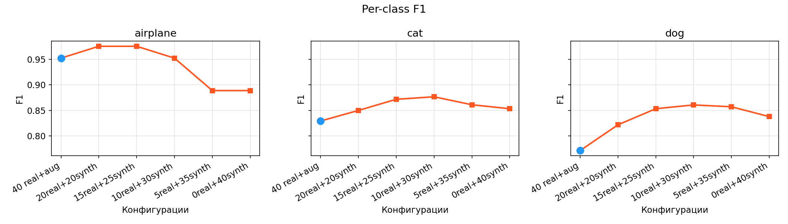
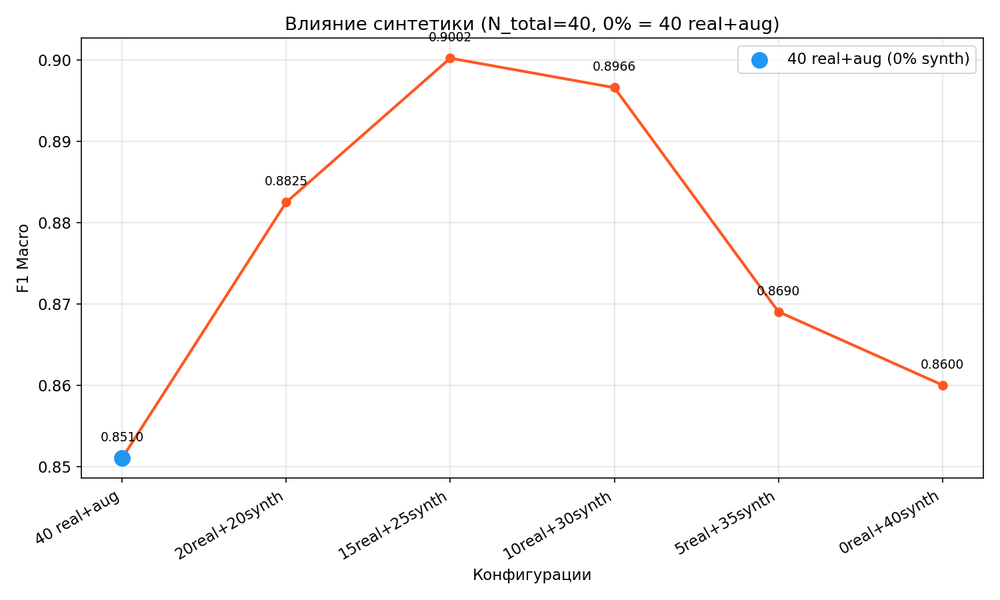

# Synthetic Data Augmentation for Rare Classes using Stable Diffusion + ControlNet

**Задача**: Улучшить классификацию редких классов (airplane, cat, dog) с помощью генерации дополнительных тренировочных изображений на основе диффузионной модели Stable Diffusion и ControlNet (Canny edge).  
**Базовая модель**: ResNet-50, предобученная на ImageNet, двухэтапный fine‑tuning.

**Результат**: Добавление синтетических данных увеличило **F1 Macro с 0.79 до 0.90** при фиксированном размере обучающей выборки.

---

## Генерация синтетических данных

### Используемые модели
- **Stable Diffusion v1.5** (`runwayml/stable-diffusion-v1-5`)
- **ControlNet Canny** (`lllyasviel/sd-controlnet-canny`)

### Процесс генерации
Для каждого редкого класса (`airplane`, `cat`, `dog`) из COCO val2017:
1. Из реальных изображений извлекаются bounding‑box кропы, которые затем ресайзятся до 512×512.
2. К кропам применяется детектор границ Canny, создавая карту границ.
3. По карте границ и текстовому промпту генерируется новое изображение с помощью ControlNet.
4. Каждое сгенерированное изображение сохраняется в папке `data/synthetic/<class>/`.

Всего сгенерировано **180 изображений (60 на класс)**.

Примеры синтетических изображений:

---

## Обучение базовой модели

### Архитектура
- **ResNet-50** с предобученными весами ImageNet.
- **Двухэтапный fine‑tuning**: сначала замороженный backbone (5 эпох, LR=1e-4), затем размороженный backbone (25 эпох, LR уменьшена до 1e-5 для backbone и 1e-4 для головы).
- **Loss**: CrossEntropy с label smoothing (0.1).
- **Оптимизатор**: AdamW с Cosine Annealing LR.
- **Batch size**: 32, Mixed Precision (AMP).

### Стратегия сравнения
Для честного сравнения использовался **фиксированный размер обучающей выборки – 40 изображений на класс**, где варьировалась доля синтетических данных (0%, 50%, 62.5%, 75%, 87.5%, 100%).  

Валидация проводилась на отдельной выборке, состоящей только из реальных изображений.

---

## Результаты

### Ablation Table (N_total = 40)

| Конфигурация        | F1 Macro | F1 airplane | F1 cat | F1 dog |
|---------------------|----------|-------------|--------|--------|
| 0% synth (40 + 0)   | 0.8392   | 0.9512      | 0.8000 | 0.7664 |
| 50% synth (20+20)   | 0.8825   | 0.9756      | 0.8500 | 0.8219 |
| **62.5% synth (15+25)** | **0.9002** | **0.9756** | **0.8718** | **0.8533** |
| 75% synth (10+30)   | 0.8966   | 0.9524      | 0.8767 | 0.8608 |
| 87.5% synth (5+35)  | 0.8690   | 0.8889      | 0.8611 | 0.8571 |
| 100% synth (0+40)   | 0.8600   | 0.8889      | 0.8533 | 0.8378 |

*Лучший результат выделен жирным.*

### Основные выводы
- Синтетические данные значительно улучшают метрики: **+6 п.п. F1 Macro** по сравнению с реальными+аугментациями и **+10 п.п.** по сравнению с чисто реальными (20/класс, не показан в таблице).
- Оптимальная доля синтетики – **62.5–75%**. Полностью синтетическая выборка работает чуть хуже, чем смешанная.
- Наибольший прирост получен для классов `cat` и `dog`, которые были наименее представлены в исходном датасете.

### Визуализации

**Per‑class F1**  

**Влияние синтетических данных на F1 macro**  

---
